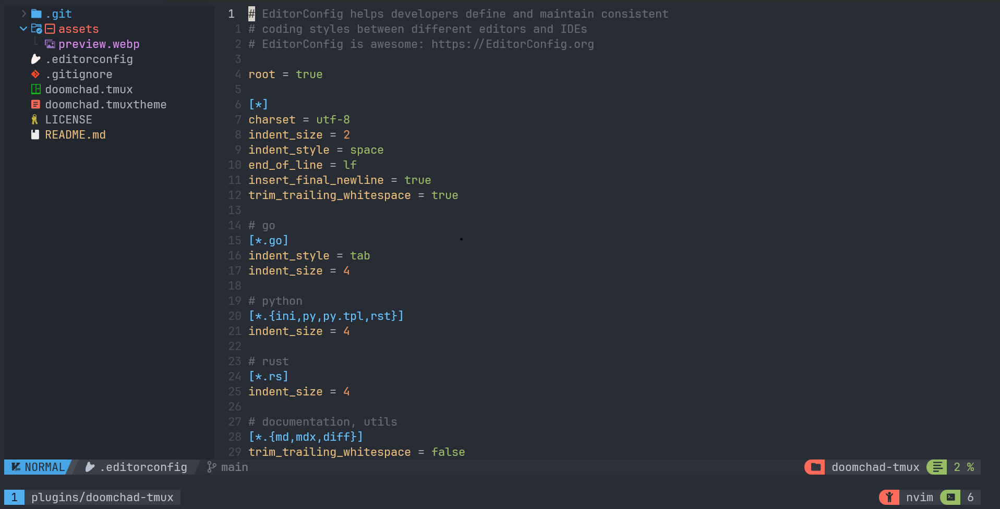

<h3 align="center">
	Doomchad theme for <a href="https://github.com/tmux/tmux">Tmux</a>
</h3>

<p align="center">
  
</p>

## Usage

### TPM

1. Install [TPM](https://github.com/tmux-plugins/tpm)
2. Add the doomchad plugin:

```bash
set -g @plugin 'SamB032/doomchad-tmux'
# ...alongside
set -g @plugin 'tmux-plugins/tpm'
```

### Manual

1. Copy your desired theme's configuration contents into your Tmux config (usually stored at `~/.tmux.conf`)
2. Reload Tmux by either restarting the session or reloading it with `tmux source-file ~/.tmux.conf`

#### Configuration options

In order to have the correct icons displayed please use your favorite nerd fonts patched font.

##### Enable window tabs

By default, the theme places the `window-status` in the `status-right`. With
`@doomchad_window_tabs_enabled` set to `on`, the theme will place the
directory within the `status-right` and move the window names to the
`window-status` format variables.

```sh
set -g @doomchad_window_tabs_enabled on # or off to disable window_tabs
```

##### Configure separator

By default, the theme will use a round separator for left and right.
To overwrite it use `@doomchad_left_separator` and `@doomchad_right_separator` 

```sh
set -g @doomchad_left_separator "█"
set -g @doomchad_right_separator "█"
```

##### Enable User

By default, the `user` componenet is set to off.
It can be enabled by toggoling it on.

```sh
set -g @doomchad_user "on"
```

##### Enable Host

By default, the `host` componenet is set to off.
It can be enabled by toggoling it on.

```sh
set -g @doomchad_host "on"
```

## 💝 Thanks to
- [Pocco81](https://github.com/catppuccin)
- [vinnyA3](https://github.com/vinnyA3)
- [rogeruiz](https://github.com/rogeruiz)
- [DreamsOfCode](https://github.com/dreamsofcode-io)
